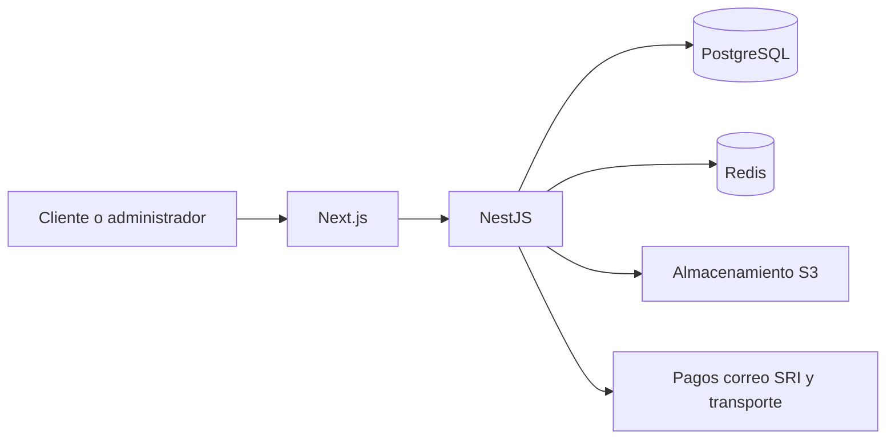

# Arquitectura inicial

Se adopta un monolito modular en un monorepositorio npm. `apps/web` contiene la experiencia Next.js y `apps/api` expone la API NestJS. PostgreSQL es la fuente de verdad; Redis soportará caché, límites y colas; el almacenamiento de objetos conservará imágenes.

## Límites

- Los módulos de negocio no accederán directamente a tablas de otros módulos.
- Los controladores traducen HTTP; las reglas viven en aplicación y dominio.
- Pagos, correo, archivos, impuestos, facturación y envíos se conectan mediante adaptadores.
- Los totales y la disponibilidad se validan siempre en el backend.

## Contexto

